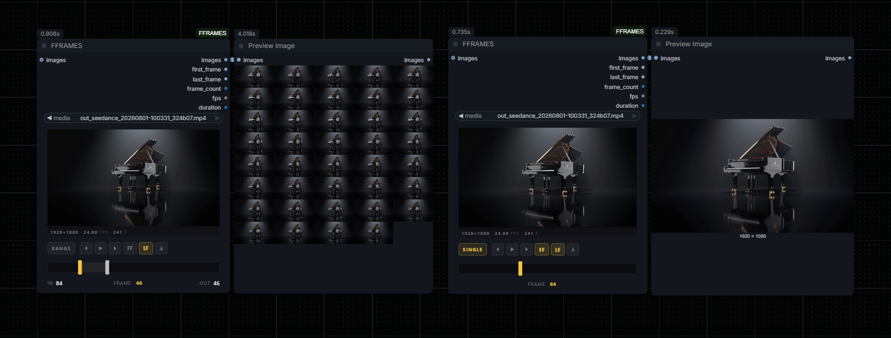

# FFRAMES

Hybrid video frame picker + trimmer for ComfyUI. Scrub a video, pick a first / last frame (or a whole range), and pipe the result into the rest of your graph — pairs cleanly with any first-frame-last-frame video model (Seedance, Wan, etc.).


## Install

```
cd ComfyUI/custom_nodes
git clone https://github.com/spiritform/FFRAMES
```

Requires `opencv-python`, `pillow`, `numpy` (already present in most Comfy installs).

## Use

Add **FFRAMES** (category `image/animation`) and either double-click the preview to upload a video, or connect an `IMAGE` batch to the `images` input (e.g. from `VHS_LoadVideo`).

### FF / LF — the two markers on the timeline

The two draggable handles on the strip are your **FF** (first frame) and **LF** (last frame) markers. They can sit anywhere on the timeline — even on the same frame, and **FF can sit past LF** (the batch output flips so the sequence runs FF → LF regardless).

The **FF** and **LF** buttons in the transport are preview-only — they jump the playhead onto that marker so you can eyeball exactly which frame it's sitting on. They light up yellow when the playhead is currently parked on that marker.



*Left: RANGE mode with FF at frame 84 and LF at frame 46 — the `images` output is a reversed sequence (frames run 84 → 46). Right: SINGLE mode with both markers on frame 84 — one frame out.*

### Outputs

| pin | type | what it is |
| --- | --- | --- |
| `images` | IMAGE | the batch of frames from FF to LF (flipped if FF > LF) |
| `first_frame` | IMAGE | single frame at the FF marker |
| `last_frame` | IMAGE | single frame at the LF marker |
| `frame_count` | INT | number of frames in `images` |
| `fps` | FLOAT | source frame rate |
| `duration` | INT | length of `images` in whole seconds (rounded) — plugs straight into `duration` fields on video models |

### Extras

- **Scrub** the timeline directly — click anywhere on the bar to move the playhead.
- **Export PNG** — the download icon saves the current frame with a zero-padded filename (`clip_f001.png`, width matches the total frame count).
- **Drag out** — drag the preview onto the canvas to spawn a `LoadImage` node containing the current frame.
- **Keyboard** — `←` / `→` step one frame, `Shift` + arrow steps 10, `Space` toggles play.
