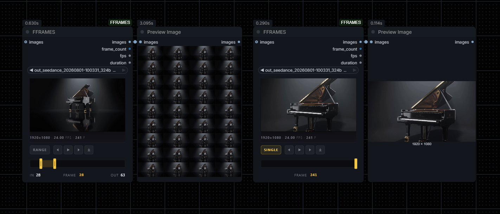

# FFRAMES

Hybrid video frame picker + trimmer for ComfyUI. One node that lets you scrub a video, pick a single frame or a range, and pipe the result into the rest of your graph.



- Accepts an **IMAGE batch** (e.g. from `VHS_LoadVideo`) or a **video file** you upload.
- Scrubbable **preview** with in / out handles.
- **SINGLE** mode (one frame) or **RANGE** mode (batch).
- Export the current frame as PNG, or drag the preview onto the canvas to spawn a `LoadImage` node.

## Install

```
cd ComfyUI/custom_nodes
git clone https://github.com/spiritform/FFRAMES
```

Requires `opencv-python`, `pillow`, `numpy` (already present in most Comfy installs).

## Use

Add **FFRAMES** (category `image/animation`). Either:

- Double-click the preview to upload a video, then drag the playhead / in-out handles, **or**
- Connect a batch of images to `images` — the picker will slice by `frame_start` / `frame_end`.

Outputs:

- `images` — the selected slice as an `IMAGE` batch
- `frame_count` — number of frames in the slice
- `fps` — source frame rate
- `duration` — slice length in seconds
